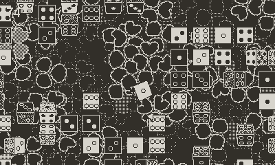
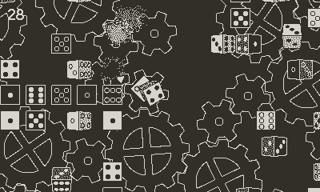
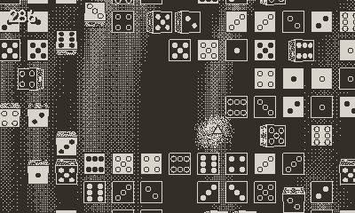
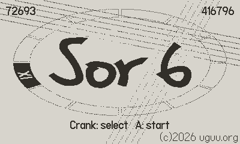
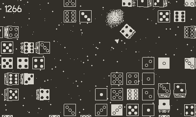
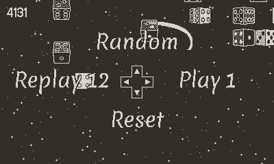

# Sor 6

A casual dice shooting game, featuring 26 minutes of classical guitar music from [Fernando Sor](https://en.wikipedia.org/wiki/Fernando_Sor)'s opus 6.

https://uguu-org.itch.io/sor6

## Controls

Press the menu button for in-game instructions.

### Title screen

Upper left corner shows the last score for the selected song.  Upper right corner shows the sum of scores across all songs.

+ (undocked) **Crank**: select song.
+ (docked) **Left** / **Right** / **Up** / **Down**: select song.
+ **A** or **B**: start.

### Game in progress

Upper left corner shows current score.  Triangle in the middle shows crank direction.

+ **Crank**: set direction.  Game will scroll in this direction, and also launch dice in this direction to match the music.  Game plays automatically when crank is docked.
+ **Right**: skip to the next song.
+ **Left**: skip to the previous song.
+ **Up**: skip to a random song.
+ **Down**: return to title screen.  Also available by selecting "reset" through the menu.

### Game over

+ **Crank**: select action.  The action will activate in 5 seconds.  This allows the game to run as a jukebox without additional input.
+ **Right**: play the next song.
+ **Left**: replay current song.
+ **Up**: play a random song.
+ **Down**: return to title screen.  Also available by selecting "reset" through the menu.

## FAQ

Q: What does Sor have to do with dice?\
A: This game was originally created for a [dice themed jam](https://itch.io/jam/playjam-9).  I was thinking of the number 6 and I happened to be practicing songs from Sor's opus 6, so there you go.

Q: How do you get the high scores like the one seen in the screenshot?\
A: You have to find and follow the special target, which takes a different path for each song.

Q: "Shooting dice" usually means something else...\
A: If you shake your Playdate a bit at the title screen, you get a dice simulator.
